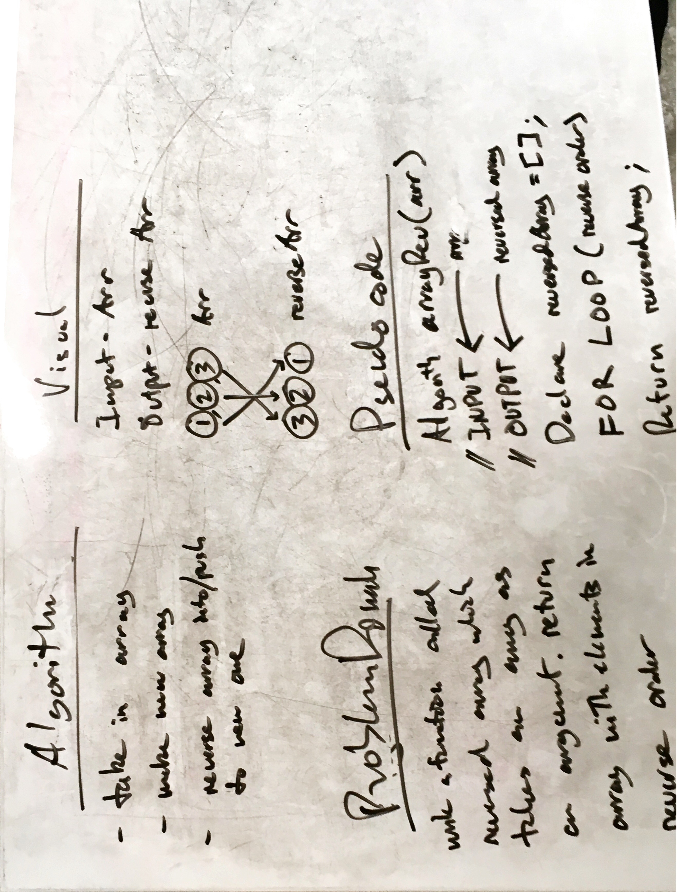

# Reverse an Array
We need to take an array, and reverse the elements

## Challenge
The challenge is to take an input array, reverse its elements, and return the reversed elements in a new array

## Solution

# Shift an Array
We need to take an array, and shift it with a new element.

## Challenge
The challenge is to take an input array and an input number, and put the number into the array at the middle, and return the new array with all of the elements of the old array plus the new element at the middle;

## Solution

